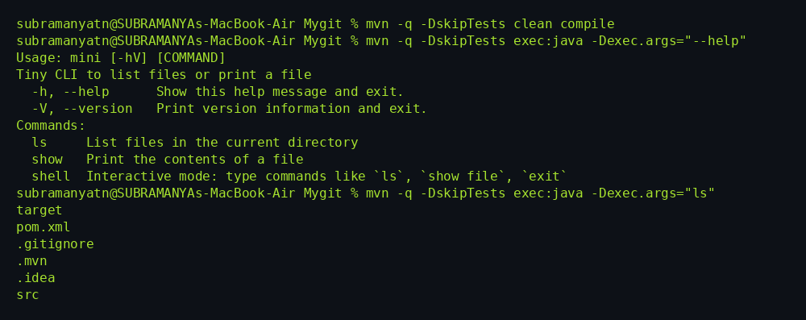
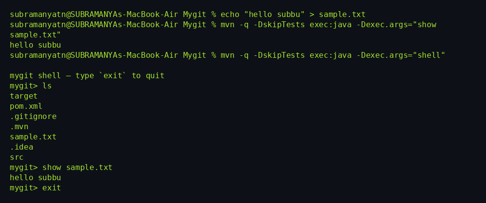

Mini CLI (Java + Maven + Picocli)

A tiny command‑line app built in **Java 21** using **Maven** and **Picocli**.  
It demonstrates how to create subcommands, parse arguments, and run an interactive shell.

## What it does

- `mini ls [DIR]` — list files in a directory (defaults to current directory)
- `mini show <FILE>` — print the contents of a file
- `mini shell` — interactive mode (REPL): run commands like `ls`, `show file`, `exit`

## Why this exists

I’m learning how Git-like CLIs are built. This project is a stepping stone to a Java implementation of Git (“Mygit”), starting from the basics: commands, arguments, and output.

## Tech

- Java 21
- Maven (exec-maven-plugin)
- Picocli

## How to run (no fat jar)
From the project root:

```zsh
# compile
mvn -q -DskipTests clean compile

# help
mvn -q -DskipTests exec:java -Dexec.args="--help"

# list files
mvn -q -DskipTests exec:java -Dexec.args="ls"

# show a file
echo "hello subbu" > sample.txt
mvn -q -DskipTests exec:java -Dexec.args="show sample.txt"

# interactive shell
mvn -q -DskipTests exec:java -Dexec.args="shell"
```

## Screenshots

**Help + `ls`**  


**`show` + interactive shell**  


## Project structure

```
Mygit/
├── pom.xml
├── src/
│   └── main/
│       └── java/
│           └── dev/
│               └── subramanya/
│                   └── Main.java
└── target/ (generated)
```

## Next steps

- Add more utilities (e.g., `head`, `tail`, `size`)
- Start Phase‑1 of Mygit (init, hash‑object, cat‑file)
- Wrap with a simple `~/bin/mygit` script for quick global use

---

Built by Subbu — practicing CLI design in Java.
